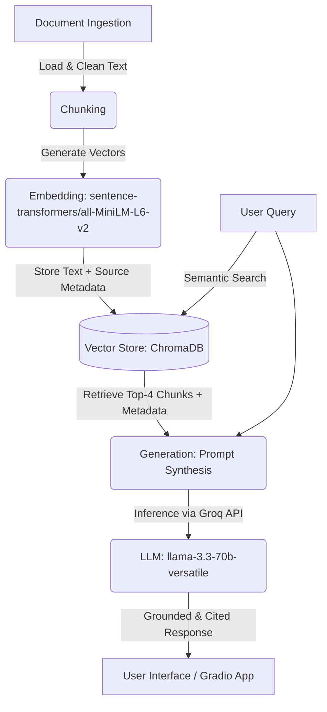

# Project 1 Planning: The Unofficial Guide

> Write this document before you write any pipeline code.
> Your spec and architecture diagram are what you'll use to direct AI tools (Claude, Copilot, etc.) to generate your implementation — the more specific they are, the more useful the generated code will be.
> Update the Retrieval Approach and Chunking Strategy sections if you change your approach during implementation.
> Update this file before starting any stretch features.

---

## Domain
I chose the domain of Computer Science professor and course reviews at Purdue, as well as a recent controversey that happened at Purdue regarding one of its teachers and his class. This student-generated knowledge is valuable because it highlights critical details like a professor's grading curve, exam style, and lecture slide dependence, which completely dictate a student's day-to-day survival in the major. Official university channels like course catalogs or generic syllabi only provide dry prerequisites and standard descriptions, leaving students blind to the actual teaching quality and workload before enrolling.

---

## Documents

I decided to use sources from YCombinator's Hacker News, r/Purdue, r/UIUC, and RateMyProfessor.

| # | Source | Description | URL or location |
|---|--------|-------------|-----------------|
| 1 | RateMyProfessor | Student comments on Jeffery Turkstra, a prominent CS professor at Purdue. | https://www.ratemyprofessors.com/professor/2231495 |
| 2 | r/Purdue | A Purdue University computer science professor, Turkstra, is facing significant backlash for using detection methods to identify and penalize students for using AI assistance on assignments in his CS 240 course. | https://www.reddit.com/r/Purdue/comments/1sngwdx/turkstra_240_and_the_institution_of_purdue/ |
| 3 | yCombinator Hacker News | Students in the Purdue University CS240 course are facing consequences after being caught using AI on assignments, a process believed to involve a tracking system described by professor Jeff Turkstra in his paper, "Tracking Large Class Projects in Real-Time Using Fine-Grained Source Control". | https://news.ycombinator.com/item?id=47814040 |
| 4 | r/Purdue | Following controversy over an AI detection tool that led to mass accusations of academic dishonesty in Purdue University's CS240 course, Professor Jeff Turkstra apologized for the retroactive application of his methodology and nullified the initial ultimatum offered to students. | https://www.reddit.com/r/Purdue/comments/1ss06od/can_someone_explain_the_cs240_drama_to_a_uiuc/ |
| 5 | r/Purdue | Professor Jeff Turkstra is facing significant backlash for using an aggressive and potentially unproven tracking tool to issue mass ultimatums to CS240 students suspected of AI-assisted cheating, creating widespread panic regarding potential expulsion just before the course drop deadline. | https://www.reddit.com/r/Purdue/comments/1snjbdq/what_the_hell/ |
| 6 | r/Purdue | Following the backlash over his aggressive and retroactive use of an unproven AI detection tool, Professor Jeff Turkstra apologized for the stress caused, nullified the coercive self-reporting forms, and limited the tool's application to future assignments, effectively halting the mass internal investigations. | https://www.reddit.com/r/Purdue/comments/1sqsy6x/cs240_lecture_summary/ |
| 7 | r/Purdue | The Reddit post offers advice to incoming Purdue CS students, suggesting that courses like CS240 under Professor Jeff Turkstra are notoriously demanding due to his strict coding standards and aggressive enforcement of academic integrity. | https://www.reddit.com/r/Purdue/comments/alxy1a/some_suggestions_for_incoming_cs_students/ |
| 8 | r/Purdue | The post critiques the instructor's approach to allegations of academic misconduct, arguing that the reliance on algorithmic detection and the use of coercive ultimatums to force confessions undermine the principles of due process and fairness. | https://www.reddit.com/r/Purdue/comments/1sp3s3t/cs240_analysis_from_200_iq_swe/ |
| 9 | r/UIUC | The discussions in the source provided highlight that while students generally agree that AI use in foundational programming courses is problematic, there is significant criticism regarding the professor's coercive handling of the situation and the fairness of using punitive measures to force confessions. | https://www.reddit.com/r/UIUC/comments/1ss0w6d/thoughts_on_purdue_cs240_scandalfiasco/ |
| 10 | r/Purdue | The post captures student skepticism regarding the instructor’s defense of the detection tool, highlighting concerns about the definition of a "low" false positive rate and the reliance on algorithmic methods that students feel fall short of rigorous evidence. | https://www.reddit.com/r/Purdue/comments/1sqqbu6/turkstra_quote_again/ |

---A Purdue University computer science professor, Turkstra, is facing significant backlash for using detection methods to identify and penalize students for using AI assistance on assignments in his CS 240 course.

## Chunking Strategy

<!-- How will you split documents into chunks?
     State your chunk size (in tokens or characters), overlap size, and explain why those
     numbers fit the structure of your documents.
     A review-heavy corpus warrants different chunking than a long FAQ. -->

**Chunk size:** 500 characters.

**Overlap:** 100 characters.

**Reasoning:** I decided to use a  500-character window to ensure essential context remains bundled, while a 100-character overlap preserves semantic continuity between segments. This balance prevents the loss of specific course details while avoiding the dilution of embedding vectors caused by blending unrelated reviews.

---

## Retrieval Approach

<!-- Which embedding model are you using (e.g., all-MiniLM-L6-v2 via sentence-transformers)?
     How many chunks will you retrieve per query (top-k)?
     If you were deploying this for real users and cost wasn't a constraint, what tradeoffs
     would you weigh in choosing a different embedding model — context length, multilingual
     support, accuracy on domain-specific text, latency? -->

**Embedding model:** all-MiniLM-L6-v2 (via sentence-transformers).

**Top-k:** k = 4.

**Production tradeoff reflection:** Switching from a local model like all-MiniLM-L6-v2 to a commercial API gives me access to a larger context window and superior handling of student slang. However, it forces a tradeoff by introducing network latency, recurring API costs, and rate-limit bottlenecks during high-traffic campus events like registration or finals week.

---

## Evaluation Plan

<!-- List your 5 test questions with their expected correct answers.
     Questions should be specific enough that you can judge whether the system's response
     is right or wrong. "What are good dining halls?" is too vague.
     "What do students say about wait times at [dining hall name] during lunch?" is testable. -->

| # | Question | Expected answer |
|---|----------|-----------------|
| 1 | What are the specific thresholds required to get an 'A' grade in Professor Turkstra's CS240 course? | To earn an A, a student must maintain a >85% homework average, a >85% exam average, and a >90% overall course average. |
| 2 | What happened during the Spring 2026 CS240 academic integrity scandal regarding assignments prior to HW11? | Professor Turkstra announced that any assignment prior to HW11 could not be evaluated by his tool or investigated using its findings. |
| 3 | How does the EnCourse tool track student development and coding habits to detect AI usage? | EnCourse forces Git commits and pushes to the student's repository every time the project Makefile or project file compiles code. |
| 4 | According to the student reviews, how many hours per week do CS240 homework assignments typically take? | Assignments are consistently reported to take anywhere from 15 to 25+ hours per week. |
| 5 | [Out-of-Scope] Where can I find the syllabus or office hour schedule for Professor Adams' CS course? | "I don't have enough information on that in the provided documents." |

---

## Anticipated Challenges

<!-- What could go wrong? Name at least two specific risks with reasoning.
     Consider: noisy or inconsistent documents, missing source attribution, off-topic
     retrieval, chunks that split key information across boundaries. -->

1. Rate My Professor and Reddit threads have massive amounts of boilerplate (timestamps, upvote counters, HTML artifacts, user flairs). If not strictly cleaned, this noise will corrupt my embeddings.

2. If chunks are detached from their source files during the splitting stage, programmatic source attribution will fail, causing the LLM to hallucinate citations.

3. If multiple professors share a last name (e.g., "Dr. Wang" for Data Structures vs. "Dr. Wang" for Machine Learning), semantic search might aggregate their reviews into a single misleading response.

---

## Architecture

<!-- Draw a diagram of your pipeline showing the five stages:
     Document Ingestion → Chunking → Embedding + Vector Store → Retrieval → Generation
     Label each stage with the tool or library you're using.
     You can use ASCII art, a Mermaid diagram, or embed a sketch as an image.
     You'll use this diagram as context when prompting AI tools to implement each stage. -->

---

## AI Tool Plan

<!-- For each part of the pipeline below, describe:
     - Which AI tool you plan to use (Claude, Copilot, ChatGPT, etc.)
     - What you'll give it as input (which sections of this planning.md, which requirements)
     - What you expect it to produce
     - How you'll verify the output matches your spec

     "I'll use AI to help me code" is not a plan.
     "I'll give Claude my Chunking Strategy section and ask it to implement chunk_text()
     with my specified chunk size and overlap" is a plan. -->

**Milestone 3 — Ingestion and chunking:**
* I will prompt the AI to generate regex patterns to clean the text from `turkstra_rmp.pdf`, scrubbing out UI elements like upvote button text and site headers.
* I will provide the AI with my file structure (`turkstra_reddit1.txt` through `turkstra_reddit9.md`) and ask it to write a Python script to enforce a recursive 500-character chunk size with a 100-character overlap.
* I will instruct the AI to write a wrapper that links each generated chunk to its source file name (e.g., `turkstra_ycomb.txt`) so source attribution is locked in early.

**Milestone 4 — Embedding and retrieval:**
* I will ask the AI to generate the initialization script for a local, persistent ChromaDB client using the `all-MiniLM-L6-v2` embedding model from `sentence-transformers`.
* I will have the AI generate a semantic search function that takes a student's query, embeds it, queries ChromaDB for the top 4 matches ($k=4$), and prints out both the text chunks and their raw distance scores for evaluation.

**Milestone 5 — Generation and interface:**
* I will use the AI to stress-test and refine a strict system prompt for `llama-3.3-70b-versatile` via the Groq API, explicitly forcing it to refuse to answer ("I don't have enough information") if the context doesn't explicitly mention the answer.
* I will prompt the AI to implement the Gradio web UI code matching the required template, mapping user text inputs to our retrieval-generation function and displaying the grounded text and source list in separate, readable textboxes.
